# 基于 Domain / Entity 的典型场景架构图

本文基于以下文档整理：
- `docs/architecture/domain-entity-analysis.md`
- `docs/architecture/domain-entity-mapping.md`

目标是围绕 Domain 与 Entity，提炼可落地的典型场景，并为每个场景给出三类 Mermaid 图：
- component designs
- data flows
- build sequences

## 一、典型场景（5 个）

1. 场景 A：CLI 启动并进入会话
2. 场景 B：一次 Tool-Use 执行（含权限治理）
3. 场景 C：MCP 能力注入到可调用工具池
4. 场景 D：插件加载并扩展 Command/Tools
5. 场景 E：会话记忆更新（Session Memory）

## 场景 A：CLI 启动并进入会话

### 1) Component Designs

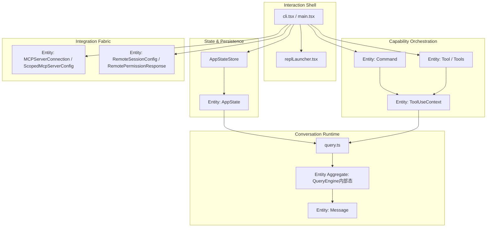

### 2) Data Flows

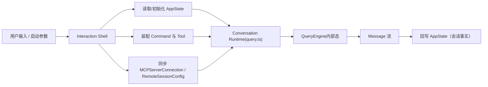

### 3) Build Sequences

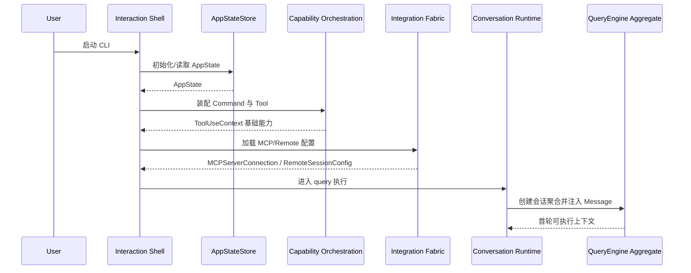

## 场景 B：一次 Tool-Use 执行（含权限治理）

### 1) Component Designs

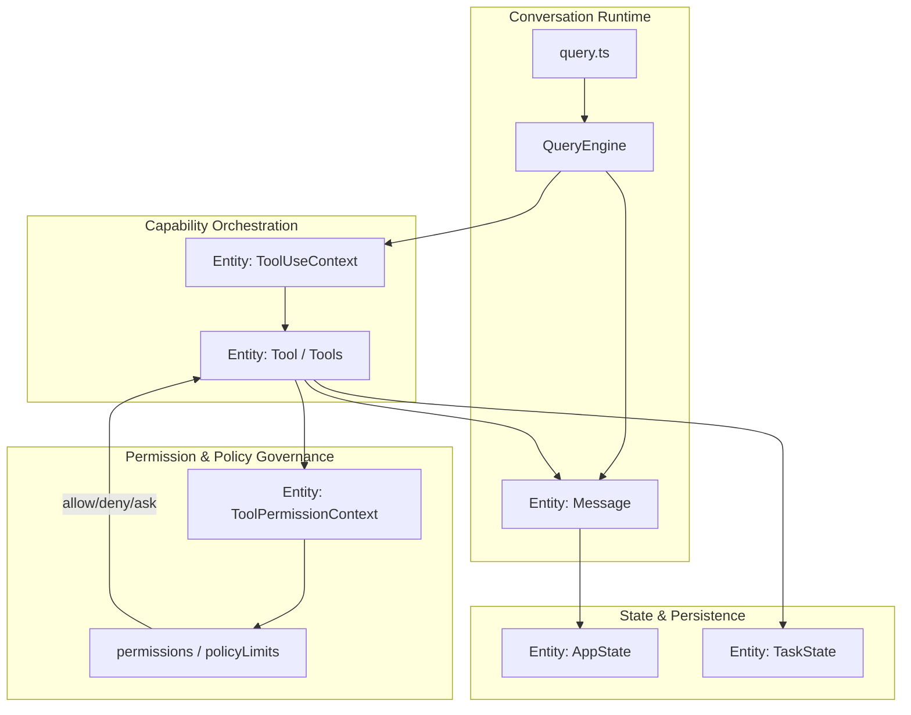

### 2) Data Flows

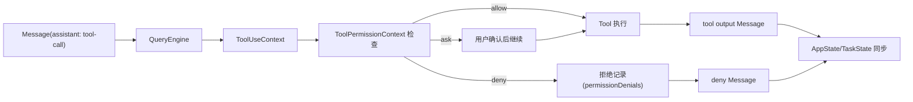

### 3) Build Sequences

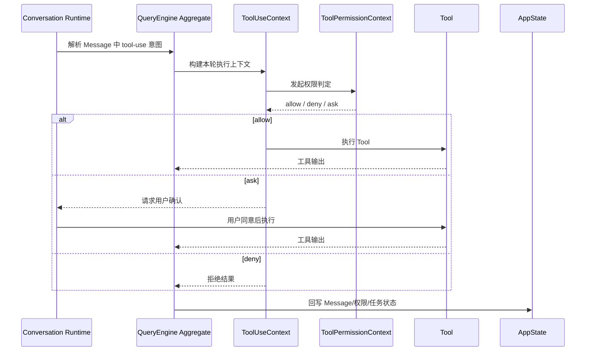

## 场景 C：MCP 能力注入到可调用工具池

### 1) Component Designs

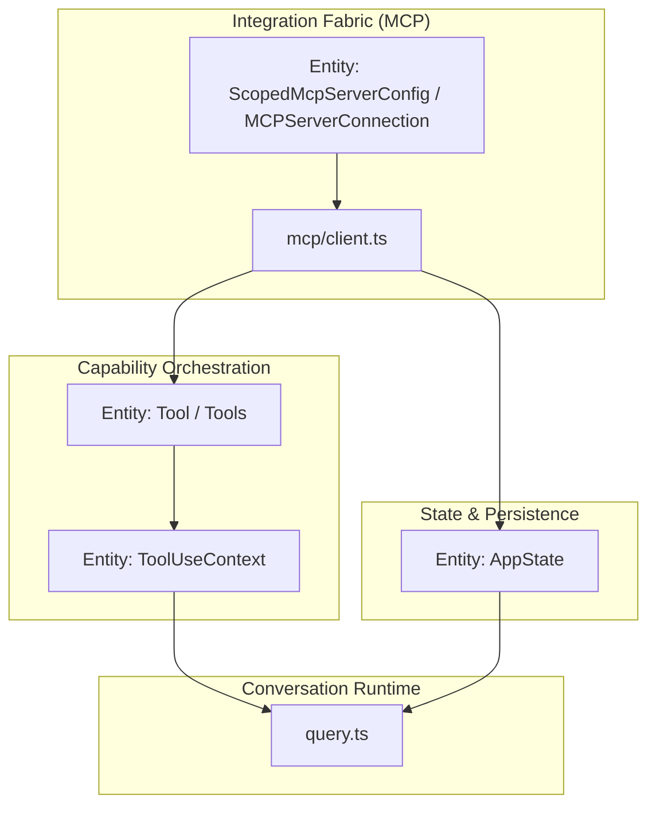

### 2) Data Flows

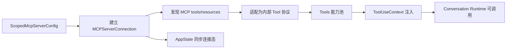

### 3) Build Sequences

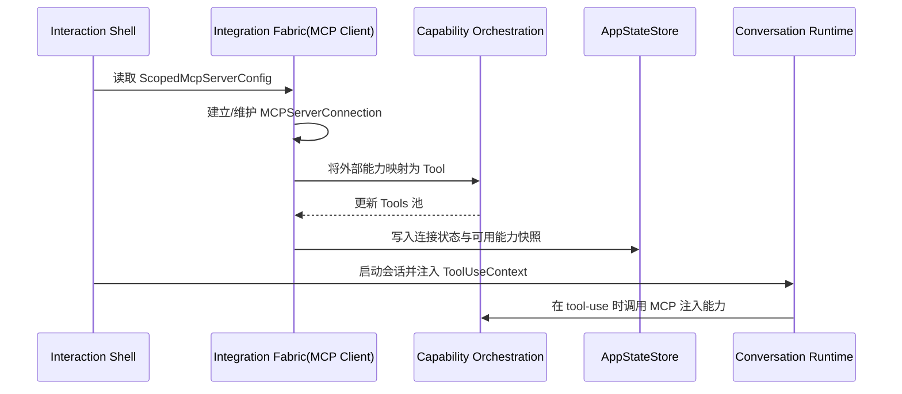

## 场景 D：插件加载并扩展 Command/Tools

### 1) Component Designs

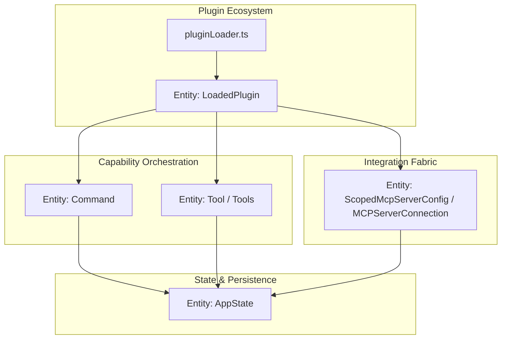

### 2) Data Flows

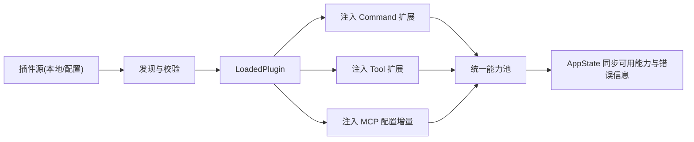

### 3) Build Sequences

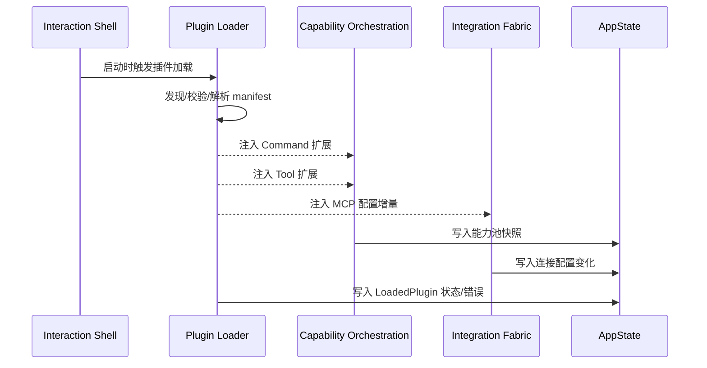

## 场景 E：会话记忆更新（Session Memory）

### 1) Component Designs

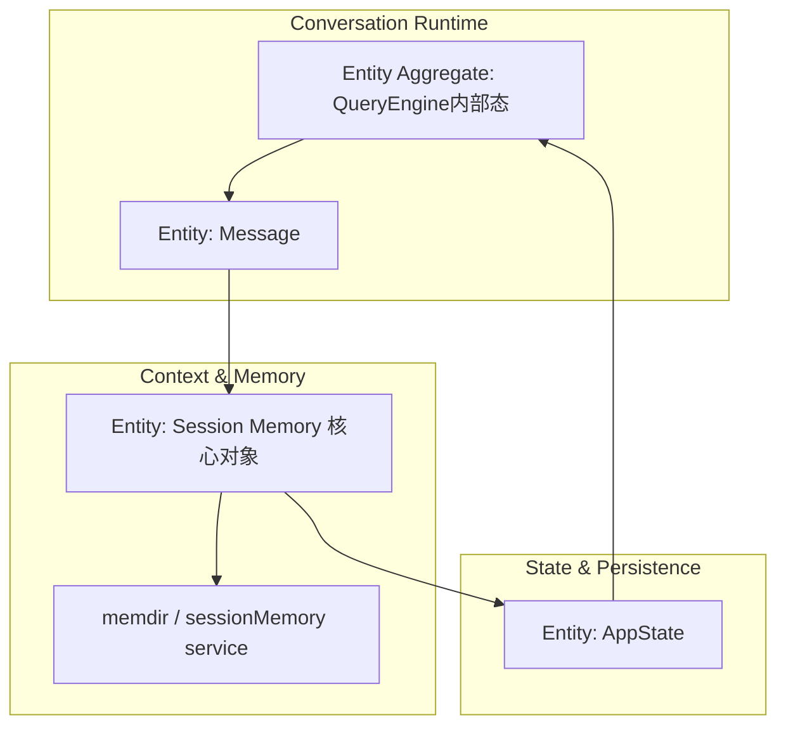

### 2) Data Flows

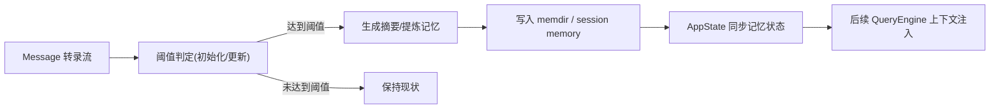

### 3) Build Sequences

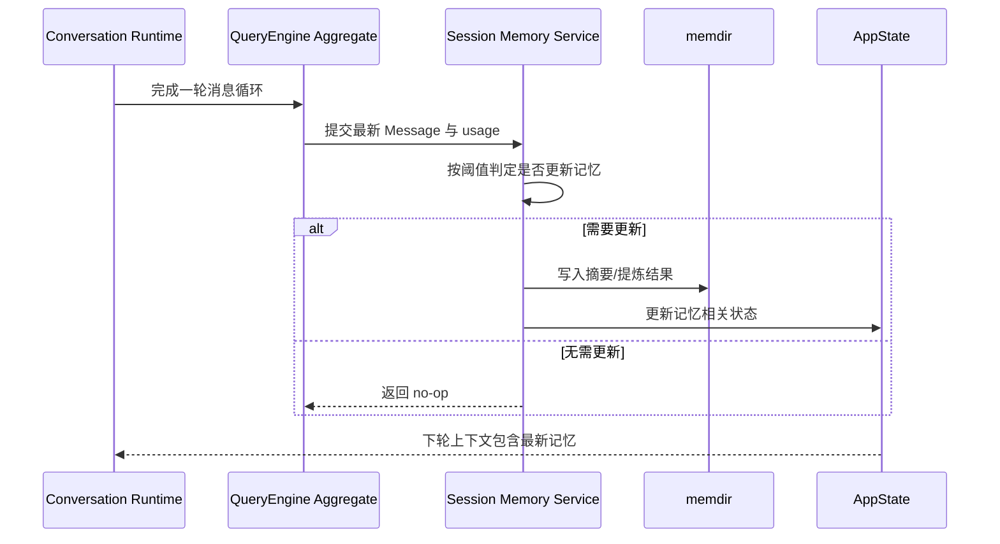

## 二、统一建模约束（落地建议）

- 节点命名优先保持 `Domain + Entity` 术语一致：`AppState`、`Message`、`ToolUseContext`、`ToolPermissionContext`、`MCPServerConnection`、`LoadedPlugin`。
- `Conversation Runtime` 与 `QueryEngine内部态`建议持续分层：前者编排流程，后者维护会话聚合状态。
- 所有可执行能力（Tool/Command/MCP注入/插件注入）统一进入能力池与 `ToolUseContext`，避免旁路执行。
- 权限判定统一经 `ToolPermissionContext`，减少策略逻辑分散。
- 记忆更新以 `Message` 与会话聚合信号为输入，状态回写统一走 `AppState`。
